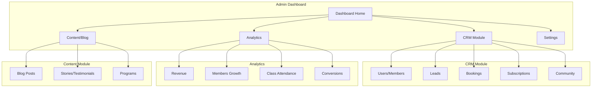

# Shakti Yoga Kendra - CRM & Admin Dashboard Plan

## Overview

A clean, modern CRM system specifically designed for Shakti Yoga Kendra's admin team to manage members, bookings, content, and view analytics.

---

## Architecture



---

## Module Breakdown

### 1. Dashboard Home
- Quick stats overview (cards)
- Recent activity feed
- Quick actions panel
- Upcoming classes/sessions

### 2. CRM Module

#### 2.1 Users/Members
- List all users with filters (role, plan, status)
- User details view with profile, subscription, booking history
- Edit user information
- Impersonate user (for support)

#### 2.2 Leads (New)
- Capture leads from trial forms
- Lead status pipeline: New → Contacted → Trial → Converted/Lost
- Lead source tracking (WhatsApp, Website, Referral)
- Assign leads to staff

#### 2.3 Bookings
- View all therapy bookings
- Calendar view of sessions
- Reschedule/cancel functionality
- Session notes

#### 2.4 Subscriptions
- Active subscriptions list
- Renewal tracking
- Cancellation handling
- Payment history

#### 2.5 Community
- WhatsApp group links management
- Member group assignments

### 3. Content/Blog Module

#### 3.1 Blog Posts
- CRUD for blog posts
- Rich text editor
- Category management
- Draft/Published/Archived states
- Featured image upload
- SEO fields (meta title, description, slug)

#### 3.2 Stories/Testimonials
- Approve/reject user stories
- Feature on homepage
- Edit testimonial content

#### 3.3 Programs
- Manage program descriptions
- Schedule display (weekly schedule for yoga)

### 4. Analytics Dashboard (New)

#### 4.1 Overview Cards
- Total Revenue (MRR)
- Active Members
- Trial → Paid Conversion Rate
- Class Attendance Rate

#### 4.2 Charts
- Revenue over time (line chart)
- Member growth (area chart)
- Booking trends (bar chart)
- Geographic distribution (members by country)

#### 4.3 Tables
- Top performing content
- At-risk members (no activity in 7 days)
- Upcoming renewals

### 5. Settings
- Profile settings
- WhatsApp integration
- Email templates
- Timezone settings

---

## Implementation Plan

### Phase 1: Foundation
- [ ] Enhance admin layout with proper navigation
- [ ] Create AdminSidebar component with icons
- [ ] Add page headers with breadcrumbs

### Phase 2: CRM - Users
- [ ] Rebuild Users page with filters and search
- [ ] Create User detail modal/page
- [ ] Add subscription status badges
- [ ] User action buttons (edit, view bookings, etc.)

### Phase 3: CRM - Leads (New)
- [ ] Create Lead model in Prisma
- [ ] Leads page with pipeline view
- [ ] Lead detail and edit functionality
- [ ] Lead conversion to user

### Phase 4: Blog Module
- [ ] Enhance Blog posts with rich editor
- [ ] Category management
- [ ] Featured image upload (using existing S3)
- [ ] Blog listing with filters
- [ ] SEO meta fields

### Phase 5: Analytics Dashboard
- [ ] Analytics overview page
- [ ] Revenue chart component
- [ ] Member growth chart
- [ ] Attendance metrics
- [ ] Conversion funnel

### Phase 6: Enhancements
- [ ] Dashboard activity feed (real data)
- [ ] Calendar view for bookings
- [ ] Notification system
- [ ] Export functionality (CSV/PDF)

---

## Technical Stack

- **Framework**: Next.js 16 (App Router)
- **Database**: PostgreSQL + Prisma
- **Styling**: Tailwind CSS
- **Icons**: React Icons (clean, modern icons)
- **Charts**: Recharts (lightweight, React-native)
- **Forms**: React Hook Form + Zod validation
- **File Upload**: S3 (already configured)

---

## Design Guidelines

### Color Palette
- Primary: `#c9a227` (Gold)
- Secondary: `#6b8e23` (Olive)
- Background: `#faf9f6` (Off-white)
- Text: `#1f2937` (Dark gray)
- Success: `#22c55e` (Green)
- Warning: `#f59e0b` (Amber)
- Error: `#ef4444` (Red)

### Typography
- Headings: Playfair Display (serif)
- Body: Lato (sans-serif)

### Component Patterns
- Cards with subtle shadows
- Rounded corners (8px)
- Hover effects on interactive elements
- Status badges with colors
- Data tables with sorting/filtering
- Modal dialogs for forms/details

---

## File Structure

```
src/app/admin/
├── layout.tsx (sidebar, navigation)
├── page.tsx (dashboard home)
├── users/
│   └── page.tsx
├── subscriptions/
│   └── page.tsx
├── bookings/
│   └── page.tsx
├── leads/ (new)
│   └── page.tsx
├── community/
│   └── page.tsx
├── content/
│   └── page.tsx (blog + stories)
├── analytics/ (new)
│   └── page.tsx
└── settings/
    └── page.tsx
```

---

## API Endpoints

```
GET    /api/admin/stats - Dashboard stats
GET    /api/admin/users - List users
GET    /api/admin/users/[id] - User detail
PUT    /api/admin/users/[id] - Update user

GET    /api/admin/leads - List leads
POST   /api/admin/leads - Create lead
PUT    /api/admin/leads/[id] - Update lead
PUT    /api/admin/leads/[id]/convert - Convert to user

GET    /api/admin/bookings - List bookings
PUT    /api/admin/bookings/[id] - Update booking

GET    /api/admin/content - List blog posts
POST   /api/admin/content - Create blog post
PUT    /api/admin/content/[id] - Update blog post
DELETE /api/admin/content/[id] - Delete blog post

GET    /api/admin/analytics - Full analytics data
GET    /api/admin/analytics/revenue - Revenue chart
GET    /api/admin/analytics/members - Member growth